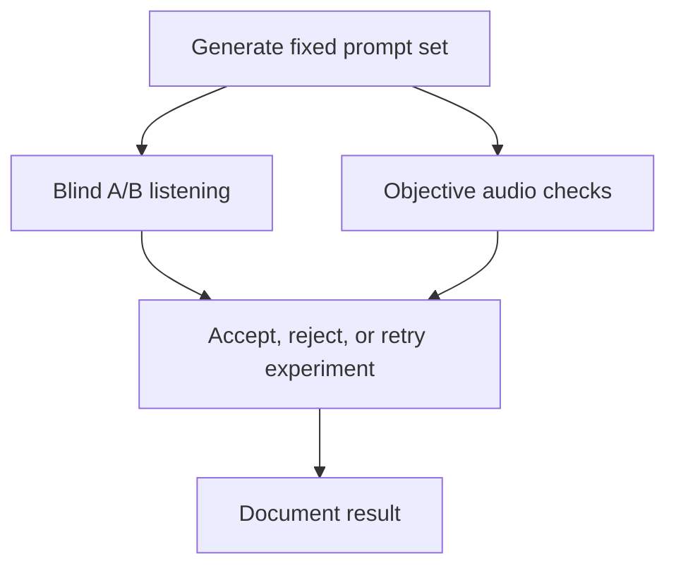

<p align="center">
  
</p>

<p align="center">
  <strong>Inflect-Nano is an ultra-small local English TTS project. Inflect-Nano-v1 is released on Hugging Face as a complete 4.63M-parameter text-to-waveform stack; Inflect-Nano-v2 is active research toward stronger 4M and 10M variants.</strong>
</p>

<p align="center">
  <a href="#inflect-nano-v1">v1 Release</a> ·
  <a href="#quickstart">Quickstart</a> ·
  <a href="#architecture">Architecture</a> ·
  <a href="#inflect-nano-v2">v2 Research</a> ·
  <a href="#evaluation">Evaluation</a> ·
  <a href="PUBLISHING.md">Publishing</a>
</p>

---

## Inflect-Nano-v1

Inflect-Nano-v1 is a tiny English text-to-speech model with **4.632M total inference parameters**, including its vocoder.

Released model:

- [owensong/Inflect-Nano-v1 on Hugging Face](https://huggingface.co/owensong/Inflect-Nano-v1)

The goal is not to beat large TTS systems. The goal is to prove how far a complete local text-to-waveform stack can be pushed at an extremely small size.

### Highlights

- 4.63M total inference parameters
- Includes the vocoder
- 24 kHz audio
- Single English male voice
- Local PyTorch inference
- Built for tiny-model experiments, local assistants, embedded demos, and efficient inference research

### Model Size

| Part | Parameters |
| --- | ---: |
| Acoustic model | 3.465M |
| Vocoder generator | 1.167M |
| Total inference stack | 4.632M |

Released model files:

```text
weights/inflect_nano_v1_acoustic.pt
weights/inflect_nano_v1_vocoder.pt
```

## Quickstart

Use the Hugging Face release for the runnable v1 model:

```bash
git clone https://huggingface.co/owensong/Inflect-Nano-v1
cd Inflect-Nano-v1
pip install -r requirements.txt
python inference.py --text "Wait, are you actually being for real now?" --out sample.wav
```

CPU:

```bash
python inference.py --device cpu --text "Please say neighborhood clearly." --out sample_cpu.wav
```

Simple controls:

```bash
python inference.py \
  --text "The appointment moved to 1:25." \
  --length-scale 1.03 \
  --pitch-scale 1.00 \
  --energy-scale 1.00 \
  --out sample_controlled.wav
```

Local Gradio demo:

```bash
python app.py
```

## Architecture

Inflect-Nano-v1 uses a compact non-autoregressive acoustic model plus a small waveform generator.


Main v1 settings:

| Setting | Value |
| --- | --- |
| Sample rate | 24 kHz |
| Mel bins | 80 |
| Acoustic hidden size | 168 |
| Encoder layers | 5 |
| Decoder layers | 6 |
| Vocoder upsample rates | 8, 8, 2, 2 |

The acoustic model predicts duration, pitch, energy, and brightness before decoding mel frames. The vocoder is a small Snake-activation HiFi-GAN-style generator trained for 24 kHz reconstruction.

## Good For

- Tiny local TTS experiments
- Offline assistant prototypes
- Efficient inference research
- Embedded speech demos
- Browser/WASM-style exploration
- Baseline comparisons for sub-5M TTS work

## Not Good For

- Production narration
- Accessibility-critical output
- Voice cloning
- Multilingual speech
- High-fidelity audiobook generation
- Matching large modern TTS systems

## Limitations

Inflect-Nano-v1 is a very small experimental model. It can sound robotic, buzzy, or unstable, especially on difficult unseen text. Long prompts and unusual phrasing are less reliable, and the vocoder is a clear quality bottleneck.

Use v1 as a tiny-model research/demo release, not as a production TTS engine.

## Inflect-Nano-v2

Inflect-Nano-v2 is the active research track. It is not released yet.

Current direction:

- two planned sizes: approximately 4M and 10M total inference parameters
- single-voice English first, with cleaner finetuning paths later
- teacher-distilled data from larger TTS systems
- stronger acoustic model experiments around prior-plus-residual CFM
- vocoder bakeoffs around compact HiFi-GAN, iSTFTNet, and source-filter variants
- objective checks plus listening tests before any release claim

The v2 rule is strict: do not trust training loss by itself. A candidate has to survive reconstruction tests, unseen-text listening, objective diagnostics, and a clear comparison against v1.

## Evaluation

Inflect is evaluated with both human listening and objective checks.



Tracked checks include:

- pronunciation and text coverage
- speaker consistency for single-voice releases
- pacing and duration stability
- skipped or invented words
- leading clicks, long silences, and internal dropouts
- loudness jumps
- real-time factor
- vocoder artifacts

See [docs/EVALUATION.md](docs/EVALUATION.md).

## Repository Map

| Path | Purpose |
| --- | --- |
| [`inflect/`](inflect/) | Inflect-native modules and extension experiments. |
| [`scripts/`](scripts/) | Dataset generation, training, rendering, evaluation, and release tooling. |
| [`inflect_asr/`](inflect_asr/) | Side project for small ASR and teacher-label pipelines. |
| [`voice-encoder/`](voice-encoder/) | Voice conditioning and paralinguistic research. |
| [`docs/`](docs/) | Architecture, roadmap, evaluation, media kit, and release notes. |
| [`examples/`](examples/) | Lightweight public examples and sample assets. |
| [`assets/`](assets/) | README and media-kit visuals. |

Local generated outputs, checkpoints, reference voices, virtual environments, and third-party checkouts are intentionally excluded from GitHub.

## Publishing

GitHub is the source, docs, and experiment-planning home. Hugging Face is the release home for runnable model weights and model cards.

Current public release:

- [owensong/Inflect-Nano-v1](https://huggingface.co/owensong/Inflect-Nano-v1)

Future v2 releases should not replace v1 until they have better listening results, cleaner diagnostics, and a reproducible release package.

## License

Repository code and documentation are licensed under Apache 2.0 unless otherwise noted.

Generated datasets, reference voices, model checkpoints, and third-party components may have separate terms. See [LICENSE](LICENSE), [PUBLISHING.md](PUBLISHING.md), and [SECURITY.md](SECURITY.md).
