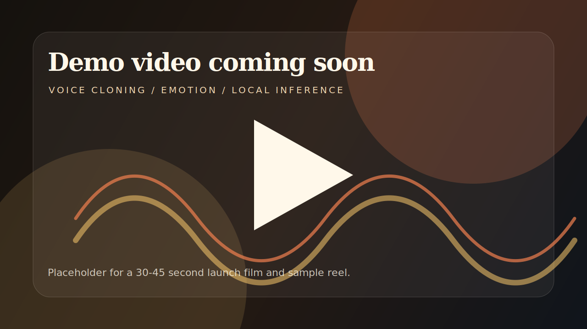
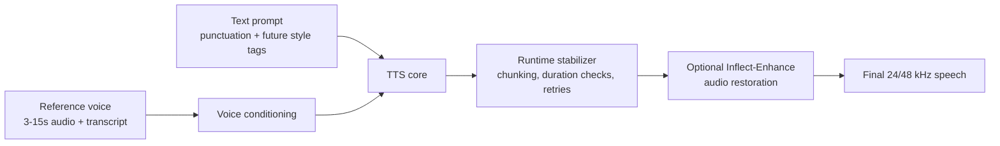

<p align="center">
  
</p>

<p align="center">
  <strong>Expressive, local-first English speech generation.</strong><br>
  A research-preview TTS stack built for zero-shot voices, natural pacing, and controllable performance on consumer hardware.
</p>

<p align="center">
  <a href="LICENSE"></a>
  
  
  
</p>

---

> **Inflect is not a polished model release yet.** This repository is the public-facing scaffold for the active research project: model experiments, benchmark harnesses, dataset tooling, and release documentation. Public weights, sample gallery, and installable packages will be linked here when they are ready.

## Why Inflect Exists

Most small TTS models force a tradeoff: clean audio but flat delivery, expressive delivery but unstable speech, or impressive demos that collapse under longer prompts. Inflect is being built around a stricter goal:

**Make a small local TTS system feel emotionally alive without losing stability.**

The near-term target is an English-only model that can run locally, clone voices from short references, handle long prompts without falling apart, and eventually support explicit style and paralinguistic controls.

## Demo Preview

<p align="center">
  <a href="docs/MEDIA_KIT.md">
    
  </a>
</p>

| Asset | Status | Notes |
| --- | --- | --- |
| Product demo video | Placeholder | Planned: 30-45 second clean launch demo. |
| Voice clone samples | In progress | Will compare base, tuned, and enhanced outputs. |
| Long-prompt stress tests | In progress | Focused on pacing, pauses, and word coverage. |
| Inflect-Enhance examples | Planned | Optional post-generation restoration stage. |

## What We Are Building

Inflect is organized as a modular speech stack:



Core areas:

- **Inflect-Nano TTS core:** the compact local generator target.
- **Runtime stability layer:** guardrails for pacing, long prompts, silence, clicks, and bad generations.
- **Inflect-Enhance:** optional audio restoration for detail, polish, and artifact cleanup.
- **Paralinguistic controls:** future text tags for breath, laugh, whisper, emphasis, and other non-verbal events.
- **Benchmark suite:** blind A/B testing, prompt stress tests, duration metrics, and ASR-based text coverage checks.

## Current Research Direction

The project is actively comparing small and medium TTS families:

| Candidate | Why It Matters | Current Read |
| --- | --- | --- |
| Lux / ZipVoice lineage | Best tiny expressiveness so far, fast generation path | Promising but needs pacing and stability work. |
| Kyutai Pocket TTS | Very consistent and compact | Stable, but too flat without serious expressiveness work. |
| Kokoro-style systems | Clean and reliable audio | Voice cloning and emotion are not the main strength. |
| Chatterbox / tag-aware systems | Useful for paralinguistic supervision | More useful as a teacher/data source than as the final small core. |
| Medium 0.3B-0.8B models | Higher ceiling if tiny models hit a wall | Backup path, not the first release target. |

The current safest conclusion: **do not blindly fine-tune until the evaluation loop proves the change helps.** Inflect uses small damage tests, blind A/B, and objective checks before committing to longer runs.

## Repository Map

| Path | Purpose |
| --- | --- |
| [`inflect/`](inflect/) | Inflect-native modules and experiments. |
| [`scripts/`](scripts/) | Dataset generation, benchmark, fine-tuning, ASR, and release tooling. |
| [`inflect_asr/`](inflect_asr/) | Side project for a small high-quality ASR model and teacher-label pipeline. |
| [`voice-encoder/`](voice-encoder/) | Voice-conditioning and paralinguistic research area. |
| [`docs/`](docs/) | Public roadmap, architecture notes, eval plan, and media kit. |
| [`assets/`](assets/) | Lightweight README/media placeholders. |
| [`patches/`](patches/) | Local patch sets for upstream research dependencies. |

Local-only research folders such as `outputs/`, `reference_voices/`, `ZipVoice-official/`, and `third_party/` are intentionally not part of the publishable GitHub payload.

## Quickstart

This repo is still research-grade, so the commands below are for contributors running the current workspace, not end users installing a released package.

```powershell
git clone https://github.com/owenawsong/Inflect.git
cd Inflect
```

Create or activate the project environment used by the current experiments:

```powershell
.\.venv-voxcpm\Scripts\python.exe --version
```

Run a local blind A/B server after generating a benchmark folder:

```powershell
.\.venv-voxcpm\Scripts\python.exe blind_ab_server.py `
  --bench-root outputs\zipvoice_bench\YOUR_BENCH `
  --state-dir .blind_ab_state_YOUR_BENCH `
  --port 18132
```

See the docs before running training jobs:

- [Architecture](docs/ARCHITECTURE.md)
- [Evaluation Plan](docs/EVALUATION.md)
- [Roadmap](docs/ROADMAP.md)
- [Publishing Guide](PUBLISHING.md)

## Evaluation Philosophy

Inflect is judged by listening first, but not only by listening.

We track:

- Speaker similarity and voice consistency.
- Naturalness, emotion, and pacing.
- Long-prompt stability.
- Word coverage and skipped-word rate.
- Leading clicks, breath artifacts, silence, and RMS jumps.
- Runtime speed, memory footprint, and local deployability.

The benchmark loop is designed to catch the failures that polished demos hide.

## Inflect-ASR

Inflect also includes a side project for small English ASR/STT. The current plan is to start from Moonshine Small, use strong teacher models such as MiMo V2.5 ASR for filtered pseudo-labeling, and evaluate against Open-ASR-style subsets.

See [`inflect_asr/ROADMAP.md`](inflect_asr/ROADMAP.md).

## Release Plan

Planned public milestones:

1. **Research preview repo:** clean docs, scripts, roadmap, and reproducible benchmark harnesses.
2. **Sample gallery:** curated audio comparisons and failure cases.
3. **Inflect-Nano preview:** first usable compact TTS checkpoint.
4. **Inflect-Enhance preview:** optional lightweight restoration model.
5. **Tagged expressiveness pass:** explicit text controls for emotional and paralinguistic delivery.

See [docs/ROADMAP.md](docs/ROADMAP.md) for the fuller plan.

## Honest Status

Inflect is ambitious and still experimental. Some current model paths improve one property while hurting another. The public repo is being shaped now so that when a release lands, it is understandable, reproducible, and credible rather than just a pile of local experiments.

If a demo sounds good, it should survive the benchmark suite. If it does not, it is not release-ready.

## License

Repository code and documentation are licensed under Apache 2.0 unless otherwise noted.

Generated datasets, reference voices, third-party code, and model checkpoints may have separate terms and are documented separately when released. See [LICENSE](LICENSE) and [PUBLISHING.md](PUBLISHING.md).
