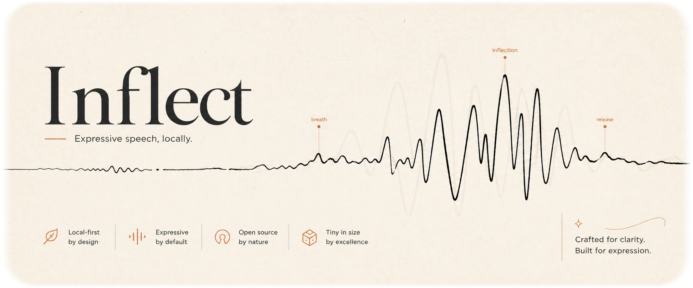
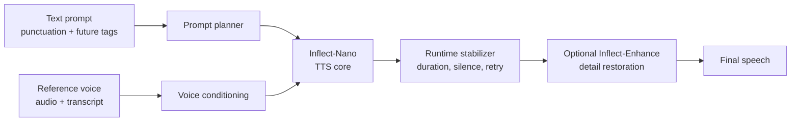
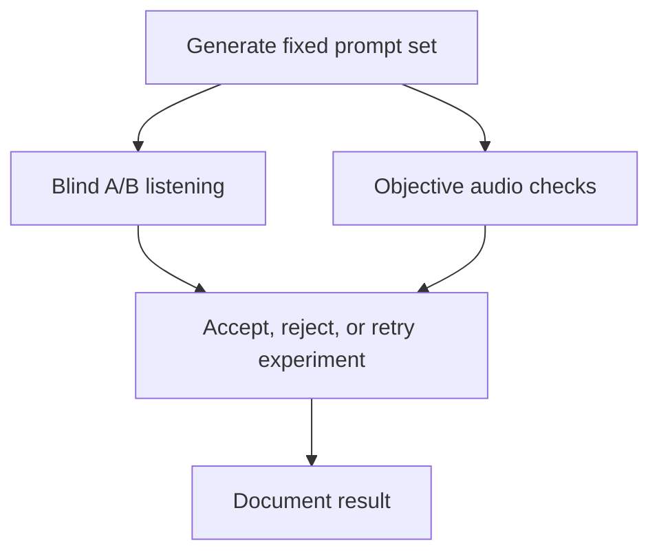

<p align="center">
  
</p>

<p align="center">
  <strong>Inflect-Nano is a local-first English TTS research project built around expressive voice cloning, stable long-form speech, and honest evaluation.</strong>
</p>

<p align="center">
  <a href="#preview">Preview</a> ·
  <a href="#architecture">Architecture</a> ·
  <a href="#evaluation">Evaluation</a> ·
  <a href="docs/ROADMAP.md">Roadmap</a> ·
  <a href="PUBLISHING.md">Publishing</a>
</p>

---

## Inflect-Nano

Small TTS models usually make you choose one:

- clean audio, but flat delivery
- expressive speech, but unstable pacing
- impressive short demos, but long-prompt collapse

**Inflect-Nano is the attempt to not accept that tradeoff.** The goal is a compact local English TTS model that can clone a voice from a short reference, speak naturally across longer text, and eventually expose direct style controls without needing a giant hosted model.

This repository is the public research scaffold: scripts, benchmark tools, architecture notes, release planning, and preview assets. Model weights and a real sample gallery will be linked when the system earns them.

## Preview

### Launch Film

<p align="center">
  <a href="docs/MEDIA_KIT.md">
    
  </a>
</p>

The final launch film is planned as a short product-style demo: reference voice, generated speech, long prompt stability, and raw-vs-enhanced audio.

### Sample Deck

These are placeholder slots for the public sample gallery. The audio files are intentionally tiny placeholder tones until real model samples are ready.

| Moment | What It Will Prove | Placeholder |
| --- | --- | --- |
| Voice clone | Short reference in, new speech out, same speaker identity. | [voice-clone-placeholder.wav](examples/audio/voice-clone-placeholder.wav) |
| Long prompt | A paragraph that keeps pacing, coverage, and voice consistent. | [long-prompt-placeholder.wav](examples/audio/long-prompt-placeholder.wav) |
| Inflect-Enhance | Raw generated output versus optional restoration pass. | [enhanced-placeholder.wav](examples/audio/enhanced-placeholder.wav) |
| Style control | Future text tags such as `<soft>`, `<breath>`, `<laugh>`, `<emphasis>`. | Planned |

### Preview Claims

The public release should make these claims only when the benchmark suite supports them:

```text
Voice cloning that stays recognizable.
Pacing that does not drift into slow motion.
Long prompts that do not skip words.
Emotion that helps the sentence instead of hijacking it.
Audio polish that is disclosed when an enhancer is used.
```

## Architecture

Inflect is designed as a stack, not a single magic checkpoint.



### The core model

Inflect-Nano is the compact TTS core. Its job is to generate the right words in the right voice with plausible rhythm and emotion. If the core skips text or loses the speaker, the enhancer is not allowed to hide that failure.

### The stabilizer

The stabilizer is the reliability layer around inference. It is meant to catch problems that small TTS models often have:

- slow-motion generations
- leading clicks
- long silences
- loudness jumps
- long-prompt collapse
- text coverage failures

### Inflect-Enhance

Inflect-Enhance is an optional post-generation restoration module. It can improve texture, detail, and artifact cleanup, but it counts as part of the enhanced pipeline. Public demos should label whether enhancement is used.

## Research Direction

The project is currently comparing small and medium TTS families, with Lux / ZipVoice-style models still the most interesting tiny direction by expressiveness.

| Path | Strength | Risk |
| --- | --- | --- |
| Lux / ZipVoice lineage | Expressive, fast, compact | Inconsistent pacing and occasional glitches. |
| Kyutai Pocket TTS | Stable and small | Too flat without major expressiveness work. |
| Kokoro-style systems | Clean audio | Less suitable for emotional zero-shot cloning. |
| Chatterbox-style teachers | Useful style/tag data | Better as teacher data than final tiny model. |
| 0.3B-0.8B models | Higher ceiling | Less aligned with the smallest local target. |

The current rule is simple: **do not trust training loss until listening and objective checks agree.**

## Evaluation

Inflect is evaluated with both human listening and objective checks.



We track:

- speaker similarity
- pacing consistency
- long-prompt stability
- skipped or invented words
- leading click / silence
- internal silence
- RMS jumps
- real-time factor
- enhancer impact

See [docs/EVALUATION.md](docs/EVALUATION.md).

## Repository Map

| Path | Purpose |
| --- | --- |
| [`inflect/`](inflect/) | Inflect-native modules and extension experiments. |
| [`scripts/`](scripts/) | Benchmarking, dataset generation, fine-tuning, and release tooling. |
| [`inflect_asr/`](inflect_asr/) | Side project for small ASR and teacher-label pipelines. |
| [`voice-encoder/`](voice-encoder/) | Voice conditioning and paralinguistic research. |
| [`docs/`](docs/) | Architecture, roadmap, evaluation, media kit, and release checklist. |
| [`examples/`](examples/) | Lightweight public examples and placeholder sample assets. |
| [`assets/`](assets/) | README and media-kit visuals. |

Local generated outputs, checkpoints, reference voices, and third-party checkouts are intentionally excluded from GitHub.

## Quickstart

This repository is still a research preview, not a polished pip package.

```powershell
git clone https://github.com/owenawsong/Inflect.git
cd Inflect
```

Run a local blind A/B server after generating a benchmark directory:

```powershell
.\.venv-voxcpm\Scripts\python.exe blind_ab_server.py `
  --bench-root outputs\zipvoice_bench\YOUR_BENCH `
  --state-dir .blind_ab_state_YOUR_BENCH `
  --port 18132
```

Read first:

- [Architecture](docs/ARCHITECTURE.md)
- [Roadmap](docs/ROADMAP.md)
- [Evaluation](docs/EVALUATION.md)
- [Release Checklist](docs/RELEASE_CHECKLIST.md)
- [Contributing](CONTRIBUTING.md)

## Honest Status

Inflect-Nano is not released yet. Some experiments improve one property while damaging another. That is why this repo is structured around proof: repeatable prompts, blind A/B, objective checks, and documentation of failures.

The target is not a cherry-picked demo. The target is a model that survives real prompts.

## License

Repository code and documentation are licensed under Apache 2.0 unless otherwise noted.

Generated datasets, reference voices, model checkpoints, and third-party components may have separate terms. See [LICENSE](LICENSE), [PUBLISHING.md](PUBLISHING.md), and [SECURITY.md](SECURITY.md).
