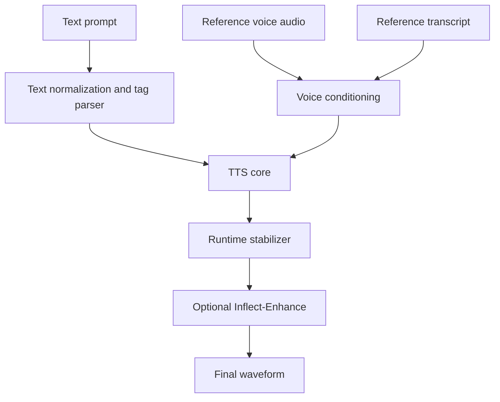

# Architecture

Inflect is a modular TTS research stack. The exact model backbone is still under evaluation, but the system boundaries are intentional.

## System Layout



## TTS Core

The TTS core is responsible for:

- text-to-speech generation
- speaker identity transfer
- prosody and rhythm
- base audio quality

The core cannot rely on the enhancer to fix semantic errors. If it skips words, repeats content, or uses the wrong voice, that is a core failure.

## Runtime Stabilizer

The runtime stabilizer is a guardrail layer around model inference.

Responsibilities:

- split unsafe long prompts into manageable chunks
- preserve sentence boundaries where possible
- trim leading artifacts
- detect abnormal duration ratios
- detect silence and loudness failures
- retry or mark failed generations
- stitch safe chunks with short crossfades

This layer should make the model more reliable without changing model weights.

## Inflect-Enhance

Inflect-Enhance is a post-processing model.

Possible implementation targets:

- lightweight waveform enhancement
- spectrogram restoration
- codec artifact removal
- detail reconstruction trained on paired low/high quality examples

Design constraint:

- keep the enhancer small enough that the full pipeline still feels local-first

Public wording should distinguish:

- TTS core parameter count
- total enhanced pipeline size

## Style Controls

The desired long-term interface is text tags, not emojis.

Examples:

```text
<calm> We can take this one step at a time.
<excited> Wait, that actually worked!
<breath> I just need a second.
<laugh> Okay, that was not supposed to happen.
```

Tag support requires:

- tagged data
- consistent annotation rules
- explicit evaluation prompts
- rejection of tags that only work by chance

## Failure Classes

Inflect treats the following as separate issues:

- pacing failure
- speaker drift
- skipped words
- hallucinated words
- emotional mismatch
- long-prompt collapse
- click/pop at start
- metallic or low-detail audio
- enhancer over-smoothing

Splitting failures this way prevents one metric from hiding a real regression.
